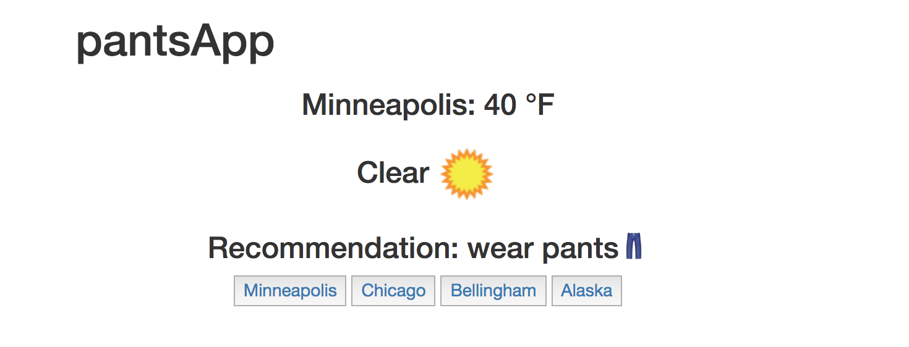

# pantsApp

Winter in Minnesota is brutal. Figuring out how many pants to wear is even worse.

This project is a simple ember front end application that will pull temperatures and weather data from the freezing north country, and will recommend how many layers to put on. (Really it's just to play around in ember to learn more about routing).  

Don't die in the snow, use pantsApp!  

#### Sample

